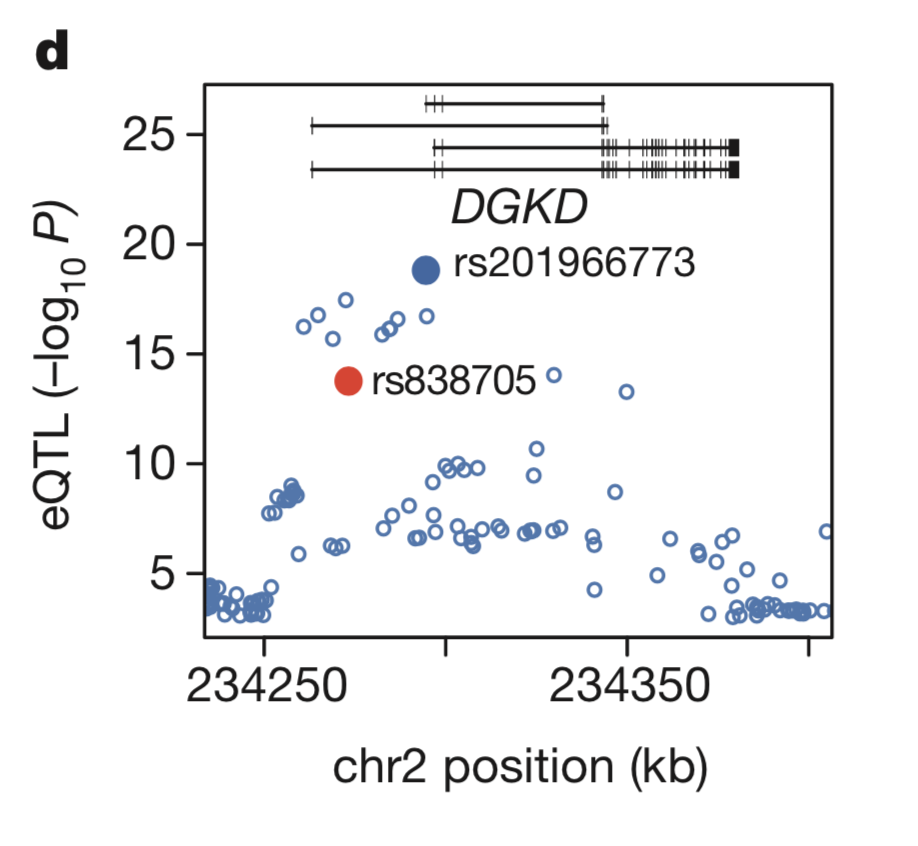

---

### III-2. eQTL Association Analysis

In this part, we will use [rvtest](http://zhanxw.github.io/rvtests) software for eQTL association analysis. 
Note that we are running just a simple score-based tests, so any other software should be fine for the basic analysis.

> <pre>
# Running association test
rvtest --inVcf cis_ENSG00000077044.vcf --pheno ENSG00000077044.ped \
	--covar ENSG00000077044.cov --covar-name SEX --out  output --single score </pre>

> <pre>
grep -vw NA output.SingleScore.assoc |sort -k13g|head -20 </pre>

><pre>
# Let's find out which SNP is rs838705 and rs21966773
grep rs838705 cis_ENSG00000077044.vcf |cut -f1-5</pre>

According to dbSNP, rs201966773 has merged into rs3075537
><pre>
grep rs3075537 cis_ENSG00000077044.vcf |cut -f1-5</pre>

rs838705 is known to be associated with [calcium levels](https://www.ebi.ac.uk/gwas/search?query=rs838705).
It is likely that our top association variant, rs3075537, is the causal one. 

---

Feel free to ask questions to your instructor(s) if you are stuck. 
, or go back to [Day 2 Overview](../day2).

---
